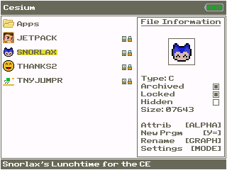

# Snorlax's Lunchtime CE

This is a port of the PokeMini "Snorlax's Lunchtime" minigame to the
TI-84 Plus CE.

---

### Installation

1. Download and send "SNORLAX.8xp" to Archive.
2. Download and install the CE C libraries, if you haven't already. You can download them 
   here: tiny.cc/clibs
3. Run prgmSNORLAX from the homescreen or shell of your choice.
---

### How to play

To navigate the menu, use [2ND] and the [UP] and [DOWN] keys and [ALPHA] to return.

The rank menu will show you your top five high scores. If you press the [->] button
in the rank menu, it will take you to a help menu. 

The goal of the game is to eat the food as fast as possible. Food will
fall onto Snorlax's plate from out of the sky, and you must press [2ND]
before the timer runs out. The faster you eat the food, the higher your
score will be. Occasionally, however, a Pichu will fall onto Snorlax's plate.
Don't ask how it got there, but you can't eat it. If you try to eat the Pichu,
it will zap you and you will lose the game.

There is also an easter egg. See if you can find it!

---

### Credits

Thanks to RoccoLox Programs for being an awesome bro and teaching me most of the 
C I used in this program, and putting up with all my feeble-brained mistakes.

Also thank you to King Dub Dub, MateoConLechuga, and darkwater4123 for the kind words
and programming tips.

---

### Disclaimer

I did not make up Snorlax, Pichu, or the original idea of
this game and I do not take any credit for anything other than coding
it onto my calculator. The original was made by Nintendo.
